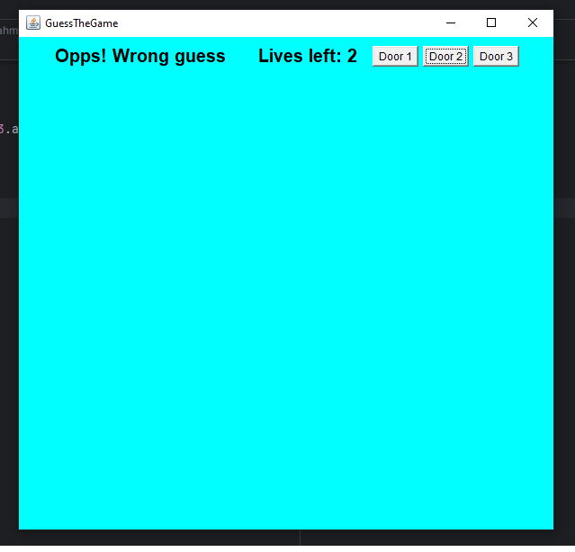
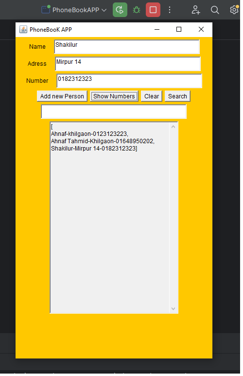
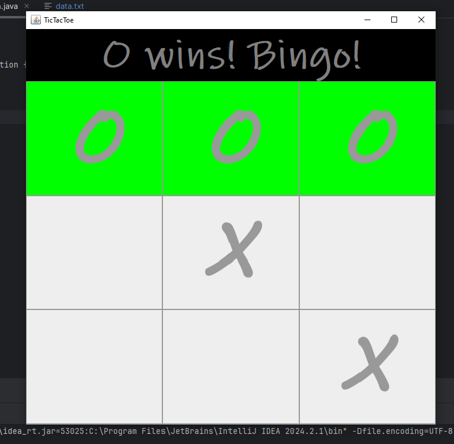

# 🎮 OOP GUI Projects

This repository contains three GUI-based Java projects built as part of my Object-Oriented Programming (OOP) course. All projects use Java AWT for the user interface and demonstrate various OOP principles through interactive games and applications.

---

## 📁 Projects Overview

### 1. 🚪 Guessing Treasure hunt

A fun door-guessing game where the player has 3 lives to find the hidden treasure behind one of three doors.  
**Twist:** After each wrong guess, the treasure randomly changes its position to another door, making it more challenging.

- ☑ 3 doors to pick from
- ☑ 3 chances (lives)
- ☑ Random shifting treasure logic
- 💡 Uses Java AWT components like `Button`, `Label`, `Frame`, and `Random`

---

### 2. 📱 Phone Book Manager (with Edit Distance)

A simple contact management app that allows users to:
- 🔍 Search names using approximate matching via **edit distance**
- ➕ Add new contacts
- ✏️ View best-matching suggestions even with typos

This project demonstrates string manipulation and basic algorithms like **Levenshtein Distance** in a GUI environment.

---

### 3. ❌⭕ Tic Tac Toe Game

A 2-player classic **Tic Tac Toe** game with a graphical interface.

- 🎮 Player vs Player (local)
- 🧠 Game logic with win-checking system
- ☑ Grid-based UI using buttons
- 💥 Win/draw detection and reset functionality

---

## 💻 Technologies Used

- Java (AWT)
- Object-Oriented Programming
- Basic Algorithm Implementation

---

## 🧠 Concepts Applied

- Inheritance & Interfaces (e.g., `ActionListener`, `WindowListener`)
- GUI programming with AWT
- Basic file I/O and data handling
- Algorithmic problem-solving (edit distance)
- Randomization logic

---

## 📸 Screenshots

### 🎯 Guessing Game

### 📞 Phone Book Manager

### ❌⭕ Tic Tac Toe

---

## 🧾 Author

**Ahnaf Tahmid**  
BSc in Computer Science & Engineering (UIU) 
OOP Course Projects 
